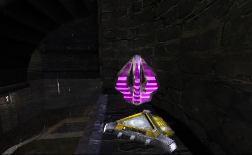

# QuadDamage



QuadDamage adds a true 4x damage pickup and a mutator that replaces stock Double
Damage pickups. 

## Use

Add `QuadDamage.MutQuadDamage` to the server's mutator list. For authored maps, place
`QuadDamage.QuadDamageCharger`. Each charger exposes `QuadDamage -> RespawnTime` in
UnrealEd and defaults to the stock UDamage interval of 90 seconds.

## Configuration

`System/QuadDamage.ini`:

```ini
[QuadDamage.MutQuadDamage]
MinAdren=0.0
```

`MinAdren` is the minimum adrenaline required to collect Quad Damage. A successful
pickup spends that amount. At `0.0`, no adrenaline is required or spent.
